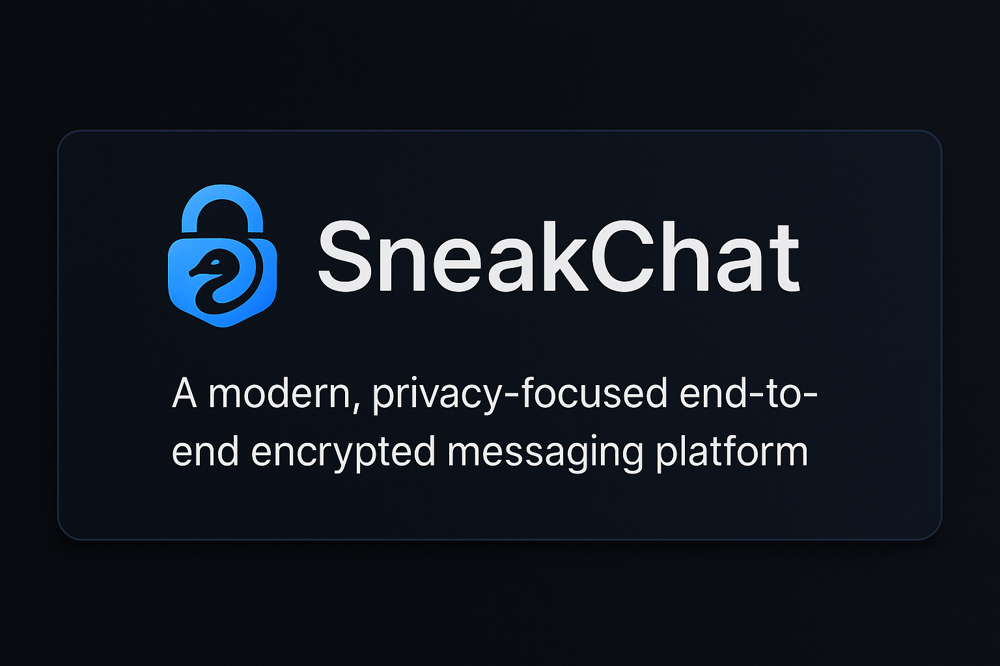
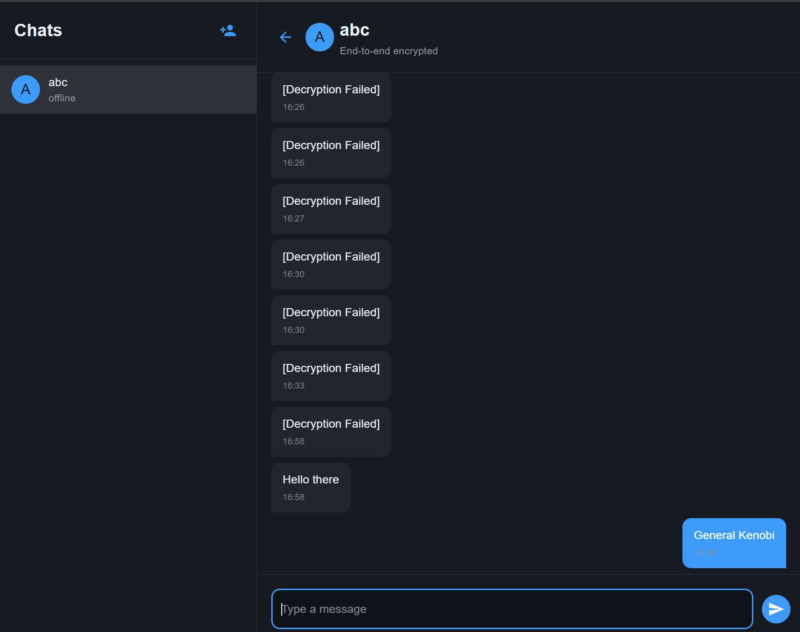

# SneakChat

A modern, privacy-focused end-to-end encrypted messaging platform that prioritizes security and data sovereignty. SneakChat provides true end-to-end encryption with no metadata collection, making it ideal for organizations and individuals who need complete privacy and control over their communications.



## 🔄 Why SneakChat?



### Comparison with Alternatives

| Feature | SneakChat | WhatsApp | Signal | Telegram | Teams |
|---------|-----------|----------|---------|----------|-------|
| End-to-End Encryption | ✅ Always | ✅ Always | ✅ Always | ⚠️ Optional | ❌ No |
| Self-Hostable | ✅ Yes | ❌ No | ❌ No | ❌ No | ❌ No |
| Open Source | ✅ Yes | ❌ No | ✅ Yes | ⚠️ Partial | ❌ No |
| Metadata Collection | ❌ None | ⚠️ Extensive | ⚠️ Minimal | ⚠️ Extensive | ⚠️ Extensive |
| Phone Required | ❌ No | ✅ Yes | ✅ Yes | ✅ Yes | ❌ No |
| Custom Deployment | ✅ Yes | ❌ No | ❌ No | ❌ No | ⚠️ Limited |
| Data Sovereignty | ✅ Complete | ❌ No | ❌ No | ❌ No | ❌ No |

### Key Advantages

1. **Complete Privacy**
   - No third-party servers involved
   - No metadata collection or analysis
   - True end-to-end encryption with no backdoors
   - Self-hosted infrastructure

2. **Enterprise Control**
   - Custom deployment options
   - Integration possibilities
   - Data sovereignty
   - Compliance friendly

3. **Modern Security**
   - Double encryption (unique for sender and recipient)
   - No server-side message decryption
   - Forward secrecy
   - Open source verification

4. **Flexibility**
   - Email-based accounts
   - Custom authentication possible
   - API-first architecture
   - Extensible platform

### Perfect For
- Organizations requiring complete privacy
- Healthcare providers (HIPAA compliance)
- Financial institutions
- Legal firms
- Government agencies
- Privacy-focused individuals
- Enterprise deployments

## 🌟 Key Features

- **True End-to-End Encryption**
  - RSA-2048 for key exchange
  - AES-256-GCM for message encryption
  - Unique encryption for both sender and recipient
  - No server-side message decryption

- **Privacy First**
  - No metadata collection
  - No phone number required
  - Self-hostable
  - Open source

- **Modern Architecture**
  - Real-time messaging with Socket.IO
  - RESTful API
  - MongoDB for scalable storage
  - React with Material-UI for modern UI

- **Enterprise Ready**
  - User management
  - Contact verification
  - Message status tracking
  - Offline message support

## 🏗️ Architecture

SneakChat follows a modern client-server architecture:

### Backend (Node.js + Express)
- **API Server**: RESTful endpoints for user management and message handling
- **WebSocket Server**: Real-time message delivery using Socket.IO
- **Database**: MongoDB for scalable message and user data storage
- **Security Layer**: JWT authentication, rate limiting, and security headers

### Frontend (React + TypeScript)
- **UI Framework**: Material-UI with custom dark theme
- **State Management**: React Context API
- **Real-time Updates**: Socket.IO client
- **Crypto Operations**: Web Crypto API for E2E encryption

### Security Architecture
```
┌─ Client A ─────────────┐         ┌─ Server ──────────┐         ┌─ Client B ─────────────┐
│ ┌─ Keypair A ───────┐ │         │                   │         │ ┌─ Keypair B ───────┐ │
│ │ - Private Key     │ │         │ - Message Routing │         │ │ - Private Key     │ │
│ │ - Public Key    ──┼─┼────────►│ - Key Exchange    │◄────────┼─┼── Public Key     │ │
│ └─────────────────┘ │         │ - No Decryption   │         │ └─────────────────┘ │
│                     │         │                   │         │                     │
│ Message + AES Key   │         │  Encrypted Msg    │         │                     │
│ encrypted with      │─────────┼─────────────────►│─────────┼─►   Decrypted with   │
│ B's Public Key      │         │                   │         │    B's Private Key   │
└─────────────────────┘         └───────────────────┘         └─────────────────────┘
```

## 🚀 Deployment Guide

### Prerequisites
- Node.js v14 or higher
- MongoDB v4.4 or higher
- npm or yarn
- SSL certificate (recommended for production)

### Step 1: Clone and Setup
```bash
# Clone the repository
git clone https://github.com/yourusername/sneakchat.git
cd sneakchat

# Install dependencies
npm install       # For server
cd client
npm install       # For client
cd ..
```

### Step 2: Configuration
Create `.env` files:

Server `.env`:
```env
PORT=5000
MONGODB_URI=mongodb://localhost:27017/sneakchat
JWT_SECRET=your-super-secret-jwt-key
CLIENT_URL=http://localhost:3000
```

Client `.env`:
```env
REACT_APP_API_URL=http://localhost:5000
REACT_APP_WS_URL=ws://localhost:5000
```

### Step 3: Database Setup
```bash
# Start MongoDB (adjust according to your setup)
mongod --dbpath /path/to/data/db

# The application will automatically create necessary collections
```

### Step 4: Build and Run
Development:
```bash
# Terminal 1 - Run server
npm run dev

# Terminal 2 - Run client
cd client
npm start
```

Production:
```bash
# Build client
cd client
npm run build
cd ..

# Start production server
npm run start
```

### Docker Deployment
```bash
# Build images
docker-compose build

# Run services
docker-compose up -d
```

## 💻 Technologies Used

### Backend
- **Node.js** - Runtime environment
- **Express** - Web framework
- **Socket.IO** - Real-time communication
- **MongoDB** - Database
- **Mongoose** - ODM
- **JWT** - Authentication
- **bcrypt** - Password hashing

### Frontend
- **React** - UI library
- **TypeScript** - Type safety
- **Material-UI** - UI components
- **Socket.IO Client** - Real-time updates
- **Web Crypto API** - Encryption operations
- **Axios** - HTTP client

### Security
- **RSA-2048** - Asymmetric encryption
- **AES-256-GCM** - Symmetric encryption
- **bcrypt** - Password hashing
- **helmet** - Security headers
- **rate-limiter** - DDoS protection

## 🔒 Security Features

### End-to-End Encryption
- RSA-2048 for key exchange
- AES-256-GCM for message encryption
- Unique IV for each message
- Forward secrecy support

### Key Management
- Client-side key generation
- Secure key exchange
- No private key transmission
- Key rotation support

### Server Security
- No message decryption capability
- No plaintext storage
- Encrypted message relay
- No metadata collection

## 🤝 Contributing

We welcome contributions! Please see our [Contributing Guide](CONTRIBUTING.md) for details.

1. Fork the repository
2. Create your feature branch (`git checkout -b feature/amazing-feature`)
3. Commit your changes (`git commit -m 'Add some amazing feature'`)
4. Push to the branch (`git push origin feature/amazing-feature`)
5. Open a Pull Request

## 📄 License

This project is licensed under the MIT License - see the [LICENSE](LICENSE) file for details.

## 🙏 Acknowledgments

- [Signal Protocol](https://signal.org/docs/) - Inspiration for security architecture
- [Material-UI](https://mui.com/) - UI components
- [Socket.IO](https://socket.io/) - Real-time capabilities
- [MongoDB](https://www.mongodb.com/) - Database solution

## 📞 Support

For support, please open an issue in the GitHub repository or contact the maintainers. 